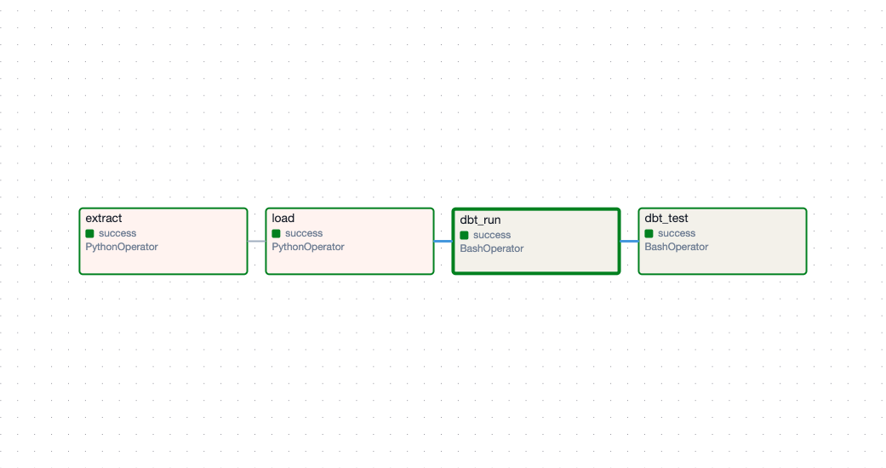

# Pactravel Data Warehouse

ELT pipeline for travel booking analytics, transforming raw flight and hotel booking data into a star schema data warehouse, orchestrated with Apache Airflow.

## Architecture

```
┌─────────────────────────────────────────────────────────────────────────────┐
│                              Apache Airflow                                  │
│                                                                              │
│   ┌──────────┐    ┌──────────┐    ┌──────────┐    ┌──────────┐            │
│   │ extract  │───▶│   load   │───▶│ dbt_run  │───▶│ dbt_test │            │
│   │ (Python) │    │ (Python) │    │ (Docker) │    │ (Docker) │            │
│   └──────────┘    └──────────┘    └──────────┘    └──────────┘            │
│         │               │               │               │                   │
└─────────┼───────────────┼───────────────┼───────────────┼───────────────────┘
          │               │               │               │
          ▼               ▼               ▼               ▼
    ┌──────────┐    ┌──────────┐    ┌──────────────────────────┐
    │  Source  │    │   DWH    │    │      Star Schema         │
    │PostgreSQL│    │PostgreSQL│    │  (dims + facts tables)   │
    │ :5433    │    │  :5434   │    │                          │
    └──────────┘    └──────────┘    └──────────────────────────┘
```

### Pipeline Tasks

| Task | Type | Description |
|------|------|-------------|
| `extract` | PythonOperator | Pull data from source PostgreSQL to CSV files |
| `load` | PythonOperator | Load CSV files to DWH staging tables |
| `dbt_run` | BashOperator | Execute dbt models (staging → marts) |
| `dbt_test` | BashOperator | Run dbt tests for data quality validation |

## Data Model


**Star Schema Design:**
- **Fact Tables:** `fct_flight_bookings`, `fct_hotel_bookings` (incremental)
- **Dimension Tables:** `dim_customers`, `dim_airlines`, `dim_aircrafts`, `dim_airports`, `dim_hotels`, `dim_date`, `dim_time`
- **SCD Strategy:** Type 1 (overwrite) with deduplication

### Incremental Strategy

Fact tables use dbt's incremental materialization with merge strategy:

```sql
{{
  config(
    materialized='incremental',
    unique_key='sk_flight_booking_id',
    incremental_strategy='merge',
    on_schema_change='append_new_columns'
  )
}}
-- 3-day lookback handles late-arriving data

where departure_date >= (select max(departure_date) - interval '3 days' from {{ this }})

```

## Pipeline Orchestration



## dbt Lineage


The lineage graph shows data flow from sources → staging views → dimension/fact tables.

**View interactive docs:**
```bash
cd dbt_pactravel
source ../.venv/bin/activate
export $(grep -v '^#' ../.env | xargs)
dbt docs serve --port 8081
```

## Tech Stack

| Layer | Tool | Version |
|-------|------|---------|
| Orchestration | Apache Airflow | 2.9.3 |
| Transformation | dbt | 1.7.4 |
| Database | PostgreSQL | 15+ |
| Containerization | Docker | 20+ |

## Project Structure

```
dbt-pactravel/
├── dags/
│   └── pactravel_elt.py          # Airflow DAG definition
├── dbt_pactravel/
│   ├── models/
│   │   ├── staging/              # Source views (stg_*)
│   │   └── marts/                # Final tables (dim_*, fct_*)
│   ├── seeds/                    # dim_date, dim_time CSVs
│   └── profiles.yml              # dbt connection config
├── docker-compose.yaml           # Source + DWH databases
├── docker-compose.airflow.yaml   # Airflow services
├── airflow.Dockerfile            # Custom Airflow image
├── dbt.Dockerfile                # Standalone dbt image
├── extract.py                    # Source extraction script
├── load.py                       # Data loading script
└── requirements.txt              # Python dependencies
```

## Getting Started

### Prerequisites

- Docker Desktop 4.0+
- Docker Compose v2
- 8GB+ RAM recommended

### Step 1: Clone and Configure

```bash
# Clone the repository
git clone https://github.com/fakhrimhd/dbt-pactravel.git
cd dbt-pactravel

# Create environment file from template
cp .env.example .env

# Edit .env with your passwords (or keep defaults for local dev)
```

### Step 2: Create Docker Network

```bash
# Create shared network for all containers
docker network create pactravel-network
```

### Step 3: Start Source and DWH Databases

```bash
# Start PostgreSQL containers
docker compose up -d

# Verify databases are running
docker ps | grep pactravel
```

Expected output:
```
pactravel-src    postgres:latest   ...   0.0.0.0:5433->5432/tcp
pactravel-dwh    postgres:latest   ...   0.0.0.0:5434->5432/tcp
```

### Step 4: Build dbt Runner Container

```bash
# Build standalone dbt image (required before starting Airflow)
docker build -t dbt-pactravel-dbt-runner:latest -f dbt.Dockerfile .
```

### Step 5: Start Airflow

```bash
# Build and start all Airflow services
docker compose -f docker-compose.airflow.yaml up -d --build

# Wait for initialization (~30 seconds)
sleep 30

# Verify all containers are running
docker ps --format "table {{.Names}}\t{{.Status}}"
```

Expected containers:
```
NAMES               STATUS
airflow-webserver   Up (healthy)
airflow-scheduler   Up (healthy)
airflow-postgres    Up (healthy)
dbt-runner          Up
pactravel-src       Up
pactravel-dwh       Up
```

### Step 6: Access Airflow UI

1. Open http://localhost:8080
2. Login with:
   - **Username:** `admin`
   - **Password:** `admin`

### Step 7: Run the Pipeline

1. Find `pactravel_elt_pipeline` in the DAGs list
2. Toggle the DAG **ON** (switch on the left)
3. Click the **Play button** (▶️) → "Trigger DAG"
4. Click on the DAG name to see the Graph view
5. Watch tasks turn green as they complete

## Container Architecture

```
┌────────────────────────────────────────────────────────────────┐
│                     pactravel-network                          │
│                                                                │
│  ┌─────────────────┐  ┌─────────────────┐  ┌─────────────────┐ │
│  │ airflow-postgres│  │airflow-webserver│  │airflow-scheduler│ │
│  │   (metadata)    │  │    (UI:8080)    │  │   (executor)    │ │
│  └─────────────────┘  └─────────────────┘  └─────────────────┘ │
│                                                                │
│  ┌─────────────────┐  ┌─────────────────┐  ┌─────────────────┐ │
│  │   dbt-runner    │  │  pactravel-src  │  │  pactravel-dwh  │ │
│  │ (dbt commands)  │  │  (source:5433)  │  │   (DWH:5434)    │ │
│  └─────────────────┘  └─────────────────┘  └─────────────────┘ │
└────────────────────────────────────────────────────────────────┘
```

## Configuration

### Environment Variables

| Variable | Description | Default |
|----------|-------------|---------|
| `SRC_POSTGRES_DB` | Source database name | `src_pactravel` |
| `SRC_POSTGRES_PORT` | Source database port | `5433` |
| `DWH_POSTGRES_DB` | DWH database name | `dwh_pactravel` |
| `DWH_POSTGRES_PORT` | DWH database port | `5434` |

### dbt Profile

The `profiles.yml` uses environment variables for portability:

```yaml
dbt_pactravel:
  target: dev
  outputs:
    dev:
      type: postgres
      host: "{{ env_var('DWH_POSTGRES_HOST', 'localhost') }}"
      port: "{{ env_var('DWH_POSTGRES_PORT', '5434') }}"
      # ... etc
```

## Useful Commands

### Airflow

```bash
# View Airflow logs
docker logs airflow-webserver
docker logs airflow-scheduler

# Restart Airflow
docker compose -f docker-compose.airflow.yaml restart

# Stop Airflow
docker compose -f docker-compose.airflow.yaml down
```

### dbt (manual execution)

```bash
# Run dbt commands directly
docker exec dbt-runner dbt run --profiles-dir .
docker exec dbt-runner dbt test --profiles-dir .
docker exec dbt-runner dbt docs generate --profiles-dir .
```

### Database Access

```bash
# Connect to source database
docker exec -it pactravel-src psql -U postgres -d src_pactravel

# Connect to DWH
docker exec -it pactravel-dwh psql -U postgres -d dwh_pactravel
```

## Troubleshooting

### Airflow webserver won't start

```bash
# Check logs
docker logs airflow-webserver

# Common fix: ensure airflow-init completed
docker compose -f docker-compose.airflow.yaml up airflow-init
```

### dbt tasks fail

```bash
# Check if dbt-runner container is running
docker ps | grep dbt-runner

# Rebuild if needed
docker build -t dbt-pactravel-dbt-runner:latest -f dbt.Dockerfile .
docker compose -f docker-compose.airflow.yaml up -d dbt-runner
```

### Network issues between containers

```bash
# Verify network exists
docker network ls | grep pactravel

# Recreate if needed
docker network create pactravel-network
```

## Stopping Everything

```bash
# Stop Airflow
docker compose -f docker-compose.airflow.yaml down

# Stop databases
docker compose down

# Full cleanup (removes volumes)
docker compose -f docker-compose.airflow.yaml down -v
docker compose down -v
docker network rm pactravel-network
```

## Key Features

- **Airflow Orchestration:** Visual DAG with task dependencies and retry logic
- **Incremental Models:** Fact tables use merge strategy with 3-day lookback for late-arriving data
- **Isolated dbt Container:** Avoids Python dependency conflicts
- **Environment-based Config:** Easy switching between local/staging/prod
- **Surrogate Keys:** Generated via `dbt_utils.generate_surrogate_key()`
- **Data Quality:** 70+ dbt tests (uniqueness, not_null, relationships, referential integrity)
- **Deduplication:** `row_number()` ensures clean dimensional data
- **Full Documentation:** Column-level descriptions and lineage graph via dbt docs

## Author

**Fakhri** — [GitHub](https://github.com/fakhrimhd)